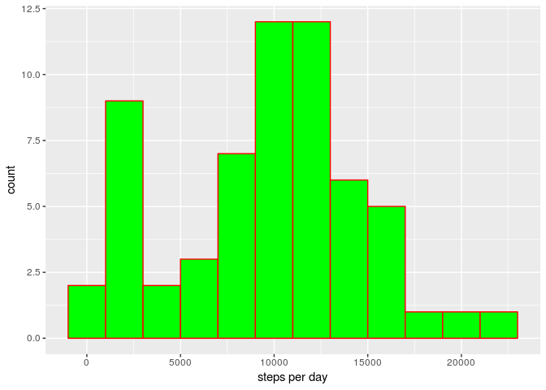

## Loading and preprocessing the data

First, we check if the csv file is already unzipped. If it is not, unzip it into
the data directory (the directory will be created if necessary).


```r
dataPathName <- "data/activity.csv"

if (!file.exists(dataPathName))
    unzip(zipfile = "./activity.zip", exdir = "data")
```

Now an R data frame is built out of the data from the file.


```r
dataSet <- read.csv(dataPathName, na.strings = "NA", 
                    colClasses = c("integer", "Date", "integer"))
```

We will use the *dplyr* package for summarizing data.
Now we load it, and compute the total number of steps for each day observed.
By now, let's discard missing values. This way the days with no valid step numbers
will appear as having zero steps.


```r
library(dplyr)
```

```
## 
## Attaching package: 'dplyr'
```

```
## The following objects are masked from 'package:stats':
## 
##     filter, lag
```

```
## The following objects are masked from 'package:base':
## 
##     intersect, setdiff, setequal, union
```

```r
totalStepsByDay <- dataSet %>% group_by(date) %>% 
    summarize(totalSteps = sum(steps, na.rm = TRUE))
```

Using the *ggplot2* package, we build the histogram of total number of steps taken
each day. Let's set the bin width to 2000 steps.  


```r
library(ggplot2)
ggplot(data = totalStepsByDay, aes(totalStepsByDay$totalSteps)) +
    geom_histogram(binwidth = 2000, col = "red", fill = "green") + 
    labs(x = "steps per day")
```

<!-- -->

## What is mean total number of steps taken per day?

Let's calculate the mean and median number of steps taken each day.
Like at the previous step, we ignore missing values.


```r
meanTotal <- mean(totalStepsByDay$totalSteps)
medianTotal <- median(totalStepsByDay$totalSteps)
sprintf("mean: %f, median: %d", meanTotal, medianTotal)
```

```
## [1] "mean: 9354.229508, median: 10395"
```

## What is the average daily activity pattern?

Now we want to analyze the average number of steps taken for each 5 minute interval.
Based on the result, we build a plot describing the average daily pattern.


```r
avgByInterval <- dataSet %>% group_by(interval) %>%
    summarize(avgSteps = mean(steps, na.rm = TRUE))

ggplot(data = avgByInterval, mapping = aes(x = interval, y = avgSteps)) +
    geom_line() + labs(x = "interval id", y = "average steps")
```

<!-- -->

The 5 minute interval(s) with the maximum average number of steps taken
is found as


```r
avgByInterval[avgByInterval$avgSteps == max(avgByInterval$avgSteps), "interval"]
```

```
## # A tibble: 1 x 1
##   interval
##      <int>
## 1      835
```

## Imputing missing values

The initial data set contains a certain number of missing values. It is output by the following code.


```r
numRowsWithMissing <- sum(is.na(dataSet$steps))
numRowsWithMissing
```

```
## [1] 2304
```

Therefore, the percentage of 5 minute intervals whose number of steps is missing is computed as


```r
percentMissing <- 100 * numRowsWithMissing / nrow(dataSet)
percentMissing
```

```
## [1] 13.11475
```

Let's substitute each missing value with the median of steps for the corresponding 5 minute interval.


```r
medianByInterval <- dataSet %>% group_by(interval) %>% summarize(
    medianSteps = median(steps, na.rm = TRUE))
dataSet <- inner_join(dataSet, medianByInterval)
```

```
## Joining, by = "interval"
```

```r
dataSet$imputedSteps <- dataSet$steps
dataSet$imputedSteps[is.na(dataSet$imputedSteps)] <-
    dataSet$medianSteps[is.na(dataSet$imputedSteps)]
```

With the missing values having been imputed, we rebuild the histogram of total number of steps taken during the day.


```r
totalStepsByDayImputed <- dataSet %>% group_by(date) %>% summarize(
    totalSteps = sum(imputedSteps))
ggplot(data = totalStepsByDayImputed, aes(totalSteps)) +
    geom_histogram(binwidth = 2000, col = "red", fill = "green") + 
    labs(x = "steps per day")
```

<!-- -->

Now we recalculate the mean and median of total steps per day.


```r
meanTotalImputed <- mean(totalStepsByDayImputed$totalSteps)
medianTotalImputed <- median(totalStepsByDayImputed$totalSteps)
sprintf("mean: %f, median: %d", meanTotalImputed, medianTotalImputed)
```

```
## [1] "mean: 9503.868852, median: 10395"
```

In comparison with the previous analysis where we ignored missing values,
the mean value has grown slightly. The median keeps its previous value.
As we introduced median values instead of NAs, the values from the left extreme of the histogram
have been redistributed because some days "got" more steps.

## Are there differences in activity patterns between weekdays and weekends?

Let's add a new categorical column saying if a given day is a weekday or weekend.


```r
# set the type weekday by default
dataSet$typeOfDay <- "weekday"
# Saturdays (6) and Sundays (0) are weekends
dataSet$typeOfDay[as.integer(format(dataSet$date, "%w")) %in% c(6, 0)] <- "weekend"
dataSet$typeOfDay <- as.factor(dataSet$typeOfDay)
```

To find the needed relationship, we need to group by day type and interval and
compute the mean summary.


```r
avgByTypeOfDayAndInterval <- dataSet %>%
    group_by(typeOfDay, interval)  %>% summarize(avgSteps = mean(imputedSteps))
```

The dynamics for weekdays and weekends is illustrated in the figure generated by
the following code.


```r
ggplot(data = avgByTypeOfDayAndInterval, 
       mapping = aes(x = interval, y = avgSteps)) +
    geom_line() + facet_wrap( ~ typeOfDay, nrow = 2) +
    labs(x = "id of 5 minute interval", y = "average steps per interval")
```

<!-- -->

Some differences can be noticed between weekdays and weekends.
On weekdays the number of steps grows rapidly around 9 AM, then there is
a peek around 2 PM. The weekend activity is more "scattered" during the day. 
